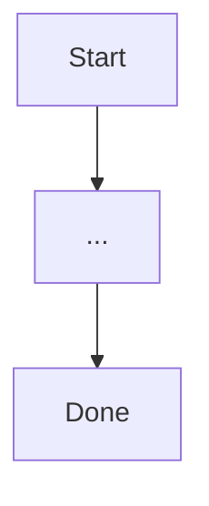

# PRD: {{product-area}}
<!-- {{product-area}}: the product or feature area this PRD covers — a short name or slug, substituted once at scaffold time (Phase 1). Used to derive the PRD's file name and slug throughout this document's state artifacts (fence file, fix files, OQ results). -->

Author: {{owner}}
<!-- {{owner}}: the PM who owns every WHAT/WHY call in this document — every fence decision, every rejected finding, every lock overrule. Nothing in the fill or gate loop marks a row decided on this person's behalf. -->

Status: draft

---

## 1. Background
<!-- guidance: State the problem this PRD solves, who is affected, and why it matters now. Close with an explicit scope statement — a bulleted in-scope list and a bulleted out-of-scope (non-goals) list — so scope creep has a written line to point at. Not conditional: every PRD owes this section. -->

**Problem statement:**

_(what's broken or missing, for whom, and why it matters now)_

**Upstream context:** this PRD traces to the product vision (the durable WHY) at `{{upstream-vision-path}}` and the current product strategy (the active bets and roadmap) at `{{upstream-strategy-path}}`. Where this PRD narrows or overrides either, say so explicitly rather than leaving the divergence implicit.

**Governance:** this document is authored, reviewed, and locked per the process rules at `{{governance-doc-path}}`.

**Home:** this PRD and its state artifacts (fence file, per-round fix files, OQ results) live under the project's product-docs directory, `{{product-docs-dir}}`.

**In scope:**

- _(bullet)_

**Out of scope (non-goals):**

- _(bullet)_

## 2. Traceability
<!-- guidance: State the row-ID conventions this document uses — Req-ID plus the §8/§9 ID families — and how Req-IDs map onto the organization's external tracking scheme. Not conditional: every requirement, error/state, and success-metric row needs a stable identity before it can be reviewed, fenced, or shipped against. -->

This document uses three row-ID families, one per dispositionable table, all sharing the same
rule: assigned once at first draft and never renumbered — a row that is cut or deferred keeps its
ID rather than freeing it for reuse.

- Every requirement row in §7 gets a Req-ID of the form `R<section>.<n>` (e.g. `R7.4`).
- Every error/state row in §8 gets an ID of the form `E<n>` (e.g. `E4`).
- Every success-metric row in §9 gets an ID of the form `M<n>` (e.g. `M2`).

Req-IDs additionally map onto this project's external tracking scheme, `{{traceability-id-scheme}}` (e.g. a ticket-tracker prefix or ID format) — the Commit PR column in §7 and the Feeds column in §10 are where that mapping becomes concrete as work lands.

## 3. Lifecycle
<!-- guidance: Show the end-to-end lifecycle of the entity or item this feature governs, in whatever diagram form actually fits the shape of that lifecycle — a state machine for a status-driven entity, a flowchart for a branching process, a sequence diagram for a multi-actor interaction. Not conditional: even a trivial lifecycle (create → use → done) is worth drawing so later sections can refer to its states by name. -->

## 4. User Journeys
<!-- guidance: Enumerate every user journey this feature supports. Each journey gets its happy-path steps AND its explicit failure branches — an error path is a journey, not an afterthought, and belongs here rather than only in §8. A diagram may accompany a journey to clarify branching, but it complements the written steps; it never replaces them — a reviewer who reads only the diagram must not miss a failure branch that only the prose captures. Not conditional. -->

### Journey: _(name)_

**Happy path:**

1. _(step)_

**Failure branches:**

- _(condition)_ → _(what the user sees / what happens next)_

## 5. Legend
<!-- guidance: Declare the two vocabularies every later table in this document depends on: the priority semantics (what each Pri value means, and where the build-order-vs-cut-line falls within the current release) and the row-status vocabulary. Not conditional: the Requirements table in §7 is unreadable without this section existing first. -->

**Priority — choose exactly one semantic for this release and delete the other bullet before lock:**

- **Build order within the release — nothing droppable.** Every P0/P1/P2 row ships in this
  release; priority only orders the sequence work happens in.
- **Cut line — lower priorities may not ship.** Priority marks what survives if scope tightens;
  the cut line is stated explicitly per release, never implied by ordering.

| Pri | Meaning |
|---|---|
| P0 | _(e.g. blocks the first usable build)_ |
| P1 | _(e.g. in this release, above the cut line)_ |
| P2 | _(e.g. candidate for this release, first to cut if scope tightens)_ |

**Status vocabulary** (every requirement, error/state, and success-metric row in this document uses exactly these six values, in this order of progression):

| Status | Meaning |
|---|---|
| pre-alignment | Drafted, not yet reviewed. |
| needs-discussion | Reviewed; at least one open objection or fork. |
| aligned | Reviewed; unanimous non-abstaining disposition, or an owner overrule recorded with the standing objection and reason. |
| in-progress | Aligned and being built. |
| done | Built and verified. |
| deferred | Explicitly cut from this release, not abandoned. |

## 6. Surfaces
<!-- conditional: user-facing surfaces only -->
<!-- guidance: Enumerate every user-facing surface this feature touches (a screen, a CLI output, an API response body, an email, a notification) and what changes on each. Conditional: if this product area has no user-facing surface (a purely internal or backend-only change), delete this section's heading and body entirely rather than leaving it empty — an internal-only PRD owes nothing here. -->

| Surface | What changes | Req-IDs |
|---|---|---|
| | | |

## 7. Requirements
<!-- guidance: This is the load-bearing table the gate reviews and the owner adjudicates row by row. Every row gets a Req-ID per §2, a Release, a Pri per §5, the requirement statement itself (WHAT-level: behavior and verifiability, not implementation), a Status per §5, and the Commit PR that lands it once in-progress or done. Not conditional. Split into multiple tables (e.g. one per release or per subsystem) if that reads better, but repeat this exact header on each. -->

| Req-ID | Release | Pri | Requirement | Status | Commit PR |
|---|---|---|---|---|---|
| | | | | | |

## 8. Error & State
<!-- guidance: Catalog every error and state condition this feature can produce. Each row gets a stable identity — the `E<n>` family defined in §2 — assigned once and never renumbered, even as rows are added, cut, or reordered — a reviewer or a later PRD may need to refer back to exactly this condition. The end-user-visible copy column is conditional on the condition actually being end-user-visible: fill it for conditions the end user sees, and mark it "n/a (internal)" for conditions that never surface past a log line. -->

| ID | Condition | Trigger | End-User-Visible Copy (n/a if internal-only) | Recovery | Status |
|---|---|---|---|---|---|
| | | | | | |

## 9. Success Metrics
<!-- guidance: Define how this feature's success is measured, precisely enough that two people computing the same metric from the same data get the same number. Each row gets a stable identity — the `M<n>` family defined in §2 — assigned once and never renumbered. Not conditional — every PRD needs a definition of done that isn't just "shipped." -->

| ID | Metric | Definition (start event, end event, statistic, population) | Candidate target | Method | Status |
|---|---|---|---|---|---|
| | | | | | |

## 10. Open Questions
<!-- guidance: Track every question this PRD cannot yet answer that blocks a row from reaching aligned status. Each question gets a stable number, the requirement rows it feeds, and what evidence would close it — an OQ without a Req-ID it feeds is scope creep, not a blocker. Not conditional. -->

| # | Question | Details | Evidence that closes it | Feeds (Req-IDs) | Evidence source | Status | Gated on | Depends on |
|---|---|---|---|---|---|---|---|---|
| | | | | | | | | |

Results file: `{{product-docs-dir}}/<prd-slug>-oq-results.md`, one `## OQ <id>` section per answer; an OQ's Status may change only when its section exists. Provisional rule (validation decides): every inline confirm-on-verification marker in this document carries its OQ id; a marker without a matching OQ is invalid.
